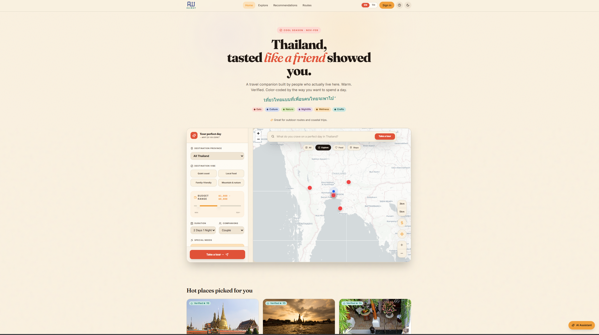
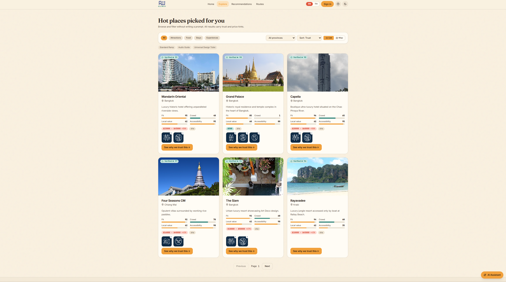
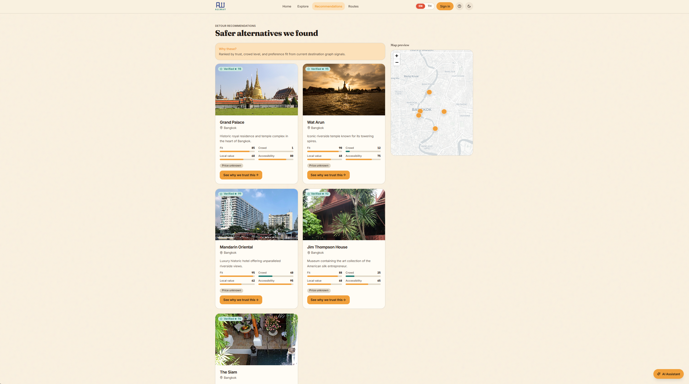
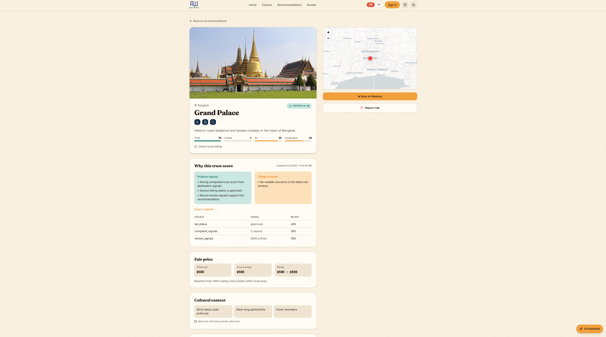
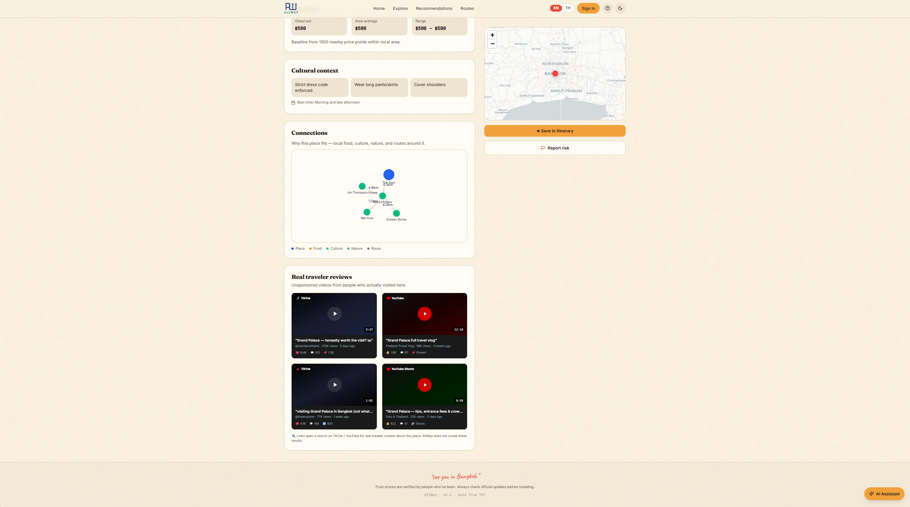
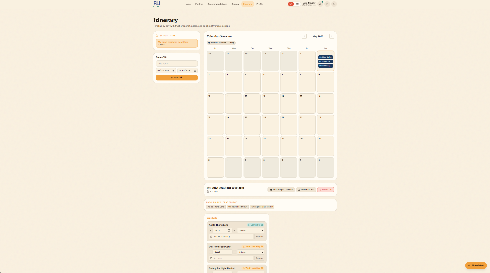
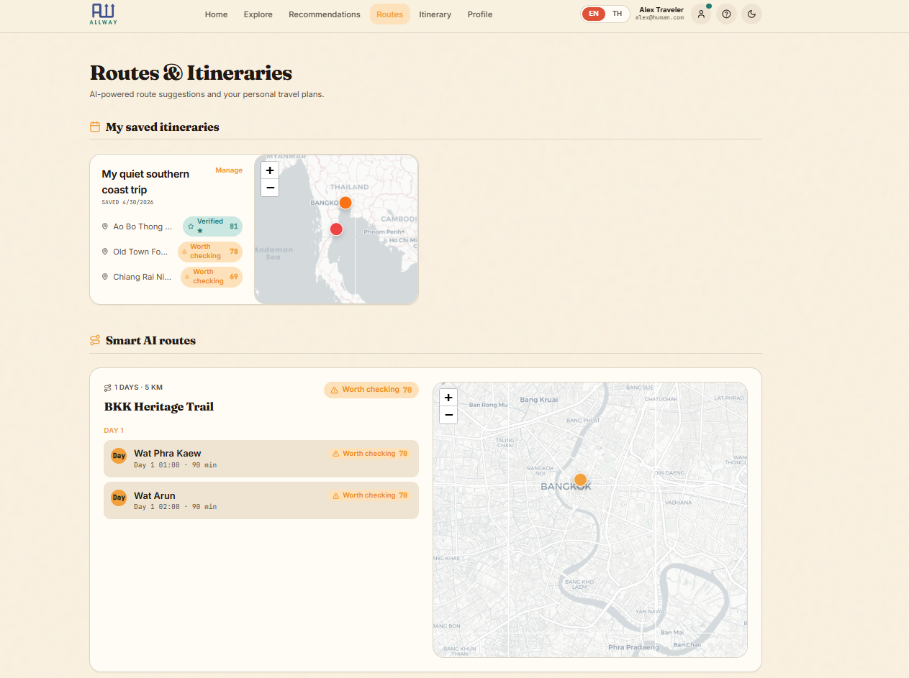
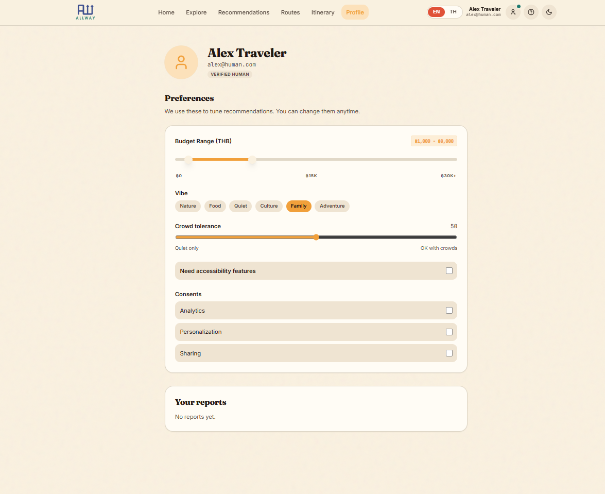
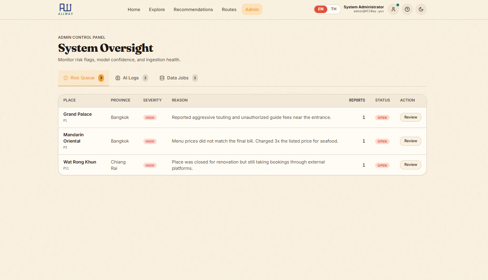

<h1 align="center">
  <a href="#">
    <picture>
      <source height="160" media="(prefers-color-scheme: dark)" srcset=".apps/web/src/assets/light.png">
      
    </picture>
  </a>
  <br>
  <a href="#">
    
  </a>
  <a href="#">
    
  </a>
  <a href="#">
    
  </a>
  <a href="#">
    
  </a>
  <a href="#">
    
  </a>
</h1>

<p align="center">
  <em><b>AllWay</b> is an AI trust layer for safer local travel in Thailand, helping tourists choose where to go, what to trust, and which options fit their trip best.</em>
</p>

---

# AllWay Thailand 🇹🇭

**Super AI Engineer SS6 by AiAT | Hackathon Project**

> AI Trust Layer for Safer Local Travel in Thailand

AllWay is not a booking super-app. It is an **AI trust layer** that helps tourists decide where to go next, what to trust, and which local packages are safer and more suitable — starting with Bangkok and nearby continuation trips.

## Architecture Preview


## Team 5 Houses · 5 disciplines · 1 mission

- **Ratchanon Buachum** (Non) - Engineering (EXP) : [@nonnnz](https://github.com/nonnnz)
- **Worapat Punsawat** (Palm) - Design (Kiddee) : [@PalmWorapat](https://github.com/PalmWorapat)
- **Narathip Wongpun** (Earth) - Data (Pangpuriye) : [@earth-repo](https://github.com/earth-repo)
- **Kriengkrai Phongkitkarun** (Heng) - Business (Machima) : [@hengkp](https://github.com/hengkp)
- **Kornkit Thansuawnkul** (Namtarn) - Data (Scamper) : [@thanstore22-cpu](https://github.com/thanstore22-cpu)

---

## Web Pages Quick Table

| Page File             | Route              | Purpose                                                                |
| --------------------- | ------------------ | ---------------------------------------------------------------------- |
| `Index.tsx`           | `/`                | Landing page with AI-style travel controls, map, and trending places   |
| `Explore.tsx`         | `/explore`         | Filterable browse page (list/map) for places                           |
| `Recommendations.tsx` | `/recommendations` | AI detour recommendations from user intent/vibe                        |
| `PlaceDetail.tsx`     | `/place/:id`       | Full place detail, trust/fair-price/culture, report, save-to-itinerary |
| `Itinerary.tsx`       | `/itinerary`       | Trip planner, calendar timeline, edit items, export calendar           |
| `Routes.tsx`          | `/routes`          | Saved itineraries overview + AI smart routes                           |
| `Profile.tsx`         | `/profile`         | User preferences and submitted reports history                         |
| `AdminDashboard.tsx`  | `/admin/dashboard` | Admin tabs for risk queue, AI logs, and data jobs                      |

---

## Monorepo Structure

```
AllWay/
├── apps/
│   ├── web/          # Vite + React + Tailwind (SSR-ready)
│   ├── api/          # ElysiaJS (TypeScript) backend
│   └── etl/          # Python ETL scripts (TAT API → PostgreSQL → Neo4j)
├── packages/
│   └── shared/       # Shared types/constants between web & api
├── docs/             # SDD documents
├── docker-compose.yml
└── README.md
```

---

## Quick Start

### Prerequisites

- Node.js 20+
- Bun (for ElysiaJS)
- Python 3.11+
- Docker (for local PostgreSQL)
- Neo4j AuraDB free tier account

### 1. Clone & install

```bash
# Install API deps
cd apps/api && bun install

# Install web deps
cd apps/web && npm install

# Install ETL deps
cd apps/etl && pip install -r requirements.txt
```

### 2. Setup environment

```bash
cp .env.example .env
# Fill in your secrets (see .env.example)
```

### 3. Start local services

```bash
docker-compose up -d   # starts PostgreSQL
```

### 4. Run ETL (seed data)

```bash
cd apps/etl
python run_all.py
```

### 5. Start dev servers

```bash
# Terminal 1 - API
cd apps/api && bun dev

# Terminal 2 - Web
cd apps/web && npm run dev
```

---

## Deployment (POC)

| Service        | Where                          |
| -------------- | ------------------------------ |
| PostgreSQL     | Docker on local PC             |
| Neo4j          | AuraDB Free Tier (cloud)       |
| API (ElysiaJS) | Local PC via Cloudflare Tunnel |
| Web (Vite)     | Local PC via Cloudflare Tunnel |
| ETL            | Python cronjob on local PC     |

Cloudflare Tunnel exposes local ports publicly without opening firewall ports.

---

## Docs

See [`/docs`](./docs/) for full Specification-Driven Development docs.

---

## Web Pages Guide (`apps/web/src/pages`)

Use this section to document each page in the web app.  
You can replace each screenshot placeholder after you capture images.

### 1) `Index.tsx` (`/`)

- Main landing page.
- Combines hero messaging, AI-style travel preference controls, province filters, budget and trip settings.
- Shows interactive map with category filters, optional pricing heatmap, place hover preview, and detail side panel.
- Shows trending places cards at the bottom.

**Screenshot Placeholder**

```md

```

### 2) `Explore.tsx` (`/explore`)

- Browse page for places with no prompt required.
- Filter by place kind, province, and sort mode.
- Supports list view (with pagination) and map view.

**Screenshot Placeholder**

```md

```

### 3) `Recommendations.tsx` (`/recommendations`)

- AI recommendation results page.
- Reads search intent and vibe from query params.
- Calls detour recommendation API, shows rationale, place cards, and map preview.

**Screenshot Placeholder**

```md

```

### 4) `PlaceDetail.tsx` (`/place/:id`)

- Deep detail page for one place.
- Includes trust score breakdown, source signals, fair price panel, cultural context, map, and explainability graph.
- Supports reporting issues and saving the place into itinerary with date/time slot.
- Includes outbound links to external reviews and platform searches.

**Screenshot Placeholder**

```md


```

### 5) `Itinerary.tsx` (`/itinerary`)

- Personal trip planning page.
- Create/select trips, manage day-by-day itinerary items, drag/drop scheduling, time and duration edits, notes.
- Calendar overview across trips.
- Export to `.ics` and open Google Calendar event templates.

**Screenshot Placeholder**

```md

```

### 6) `Routes.tsx` (`/routes`)

- Routes and trip overview page.
- Shows saved itineraries summary with mini map previews.
- Shows AI smart routes with day stops, trust badges, warnings, and route path map.

**Screenshot Placeholder**

```md

```

### 7) `Profile.tsx` (`/profile`)

- User profile and personalization page.
- Edit recommendation preferences (budget, vibes, crowd tolerance, accessibility, consent toggles).
- Displays user-submitted report history.

**Screenshot Placeholder**

```md

```

### 8) `AdminDashboard.tsx` (`/admin/dashboard`)

- Admin operations dashboard.
- Tabbed views:
- Risk queue (flagged places)
  - Focused admin triage table for risk flags.
  - Compact view of severity, reason, report count, status, and review action.
- AI logs (trace, confidence, attribution)
- Data jobs (pipeline/job health)

**Screenshot Placeholder**

```md

```

### Screenshot Folder Convention

- Recommended location: `docs/screenshots/web/`
- Suggested file names:
- `home-index.png`
- `explore.png`
- `recommendations.png`
- `place-detail.png`
- `itinerary.png`
- `routes.png`
- `profile.png`
- `admin-risk-queue.png`
